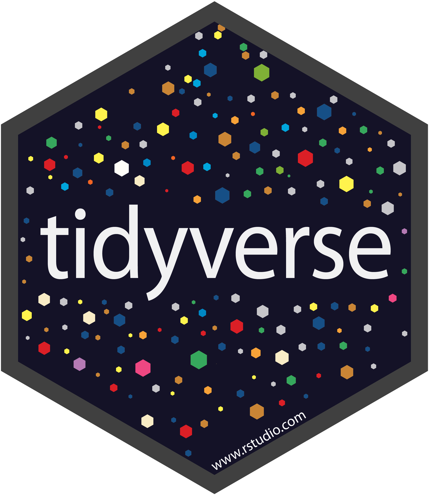
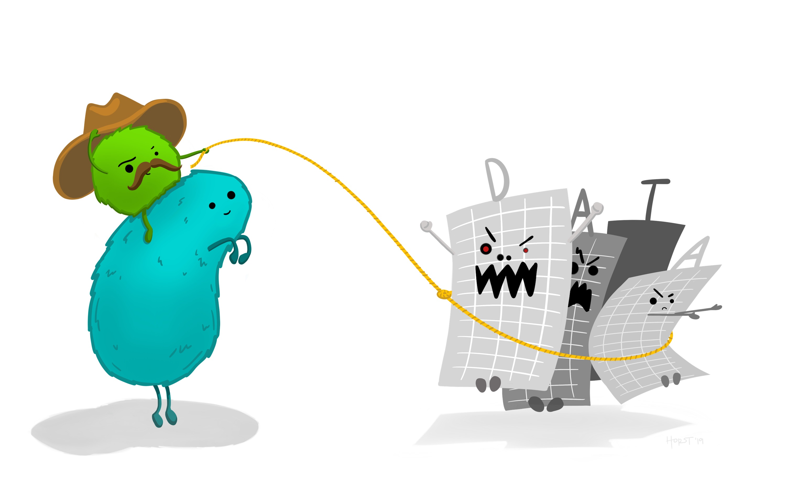
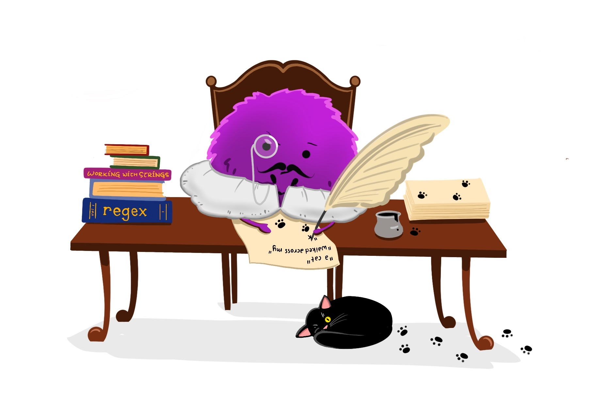
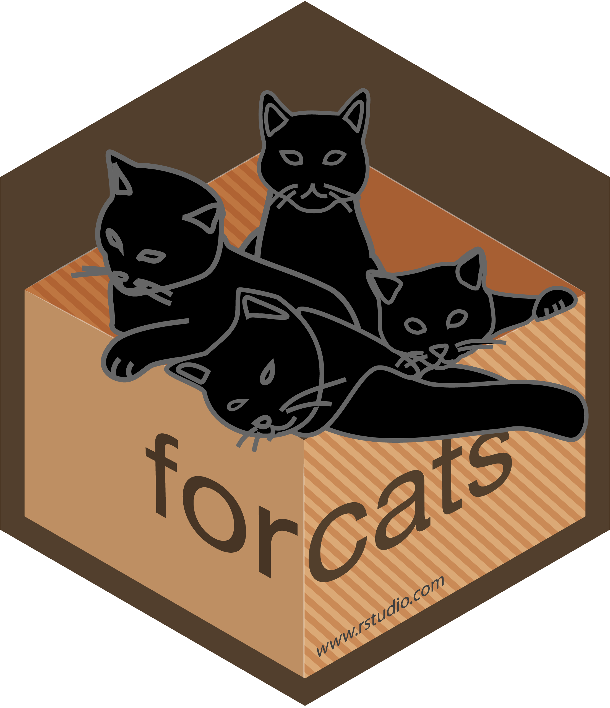

```{r setup, include=FALSE}
library(learnr)
library(tidyverse)
library(tibble)
library(fontawesome)
knitr::opts_chunk$set(echo = FALSE)

aliens <- tribble(~year, ~blue_planet, ~green_planet, ~red_planet,
                  2340, 2500, 1800, 450,
                  2562, 2135, 2068, 894,
                  2785, 2089, 1954, 715)
```

## 1. Welcome

Hello everyone! This tutorial was created for the February 2021 joint [R-Ladies Tunis](https://twitter.com/RLadiesTunis) and [R-Ladies Saudi Arabia (Dammam)](https://twitter.com/RLadiesDammam) workshop.

### What is the tidyverse?

From [tidyverse.org](https://www.tidyverse.org/): "The tidyverse is an opinionated collection of R packages designed for data science. All packages share an underlying design philosophy, grammar, and data structures." 

In other words, it's a collection of packages for data reading, wrangling, tidying, and visualization that play nicely together due to their similar design. Click the link above to learn which R packages are included in the tidyverse. 

### What are we doing today?

In this workshop, we are taking a quick flight into the tidyverse to learn just a few functions that are useful for data wrangling and visualization. We are visiting the **edge** of the tidyverse in this workshop. There are *many* other functions and packages to explore on your future missions! See the 'Future missions' section for resources that can help you travel further into the tidyverse.

### How does this tutorial work? 

**The data:** Throughout this workshop, we'll use the `starwars` dataset that exists in the `dplyr` package. Below is a view of the first 5 lines of the dataset (note that you can scroll through the variables (columns) using the arrows in the upper right and left corners of the table).  

```{r, echo = TRUE}
head(starwars, 5)
```

**Running code & getting help:** Throughout this tutorial, there are areas where we will run, edit, or write our own code. An example is shown below with some pre-populated code. Go ahead and press the 'Run' button in the top right to see the outcome of this code to make a ggplot graph!

```{r demo-1, exercise = TRUE}
ggplot(data = mtcars, aes(x = wt, y = mpg)) +
  geom_point(color = "purple", size = 3) +
  theme_minimal()
```

Sometimes, there will be incomplete placeholder code where you are asked to "fill in the blanks" for practice. In those situations, there is also a "Hint" and/or "Solution" button - if you ever get stuck, you can click on that button to copy and paste the hint or solution to the clipboard, then paste that into the code area. Try it below, as if you are asked to **update the point color to "orange" and the point size to 4** in this ggplot graph:

```{r demo-2, exercise = TRUE}
ggplot(data = mtcars, aes(x = wt, y = mpg)) +
  geom_point()
```

```{r demo-2-hint}
ggplot(data = mtcars, aes(x = wt, y = mpg)) +
  geom_point(color = "______", size = _)
```

```{r demo-2-solution}
ggplot(data = mtcars, aes(x = wt, y = mpg)) +
  geom_point(color = "orange", size = 4)
```

### Thank you & citations

Sincere thanks to developers, contributors, maintainers and community members who have created packages in the tidyverse and made so many wonderful resources to help us all learn. 

1. `tidyverse:` Wickham et al., (2019). Welcome to the tidyverse. Journal of Open Source Software, 4(43), 1686, https://doi.org/10.21105/joss.01686

2. `dplyr:` Hadley Wickham, Romain François, Lionel Henry and Kirill Müller (2020). dplyr: A Grammar of Data Manipulation. R package version 1.0.2. https://CRAN.R-project.org/package=dplyr

3. `ggplot2:` H. Wickham. ggplot2: Elegant Graphics for Data Analysis. Springer-Verlag New York, 2016.
  
4. `stringr:` Hadley Wickham (2019). stringr: Simple, Consistent Wrappers for Common String Operations. R package version 1.4.0. https://CRAN.R-project.org/package=stringr

5. `tidyr:` Hadley Wickham and Lionel Henry (2020). tidyr: Tidy Messy Data. R package version 1.1.0. https://CRAN.R-project.org/package=tidyr

6. `forcats:` Hadley Wickham (2020). forcats: Tools for Working with Categorical Variables (Factors). R package version 0.5.0. https://CRAN.R-project.org/package=forcats

7. `learnr:` Barret Schloerke, JJ Allaire and Barbara Borges (2020). learnr: Interactive Tutorials for R. R package version. 0.10.1. https://CRAN.R-project.org/package=learnr

```{r, echo=FALSE, out.width="30%", fig.align = "center"}
 
```

## 2. Graphs in ggplot2


```{r, echo=FALSE, out.width="80%", fig.align = "center", fig.cap = "Illustration by Allison Horst"}
knitr::include_graphics("www/ggplot_masterpiece.jpg") 
```

Let's start by making some data visualizations with the `starwars` data! Then we'll continue to build our wrangling & dataviz skills throughout the workshop. 

The `ggplot2` package provides "a system for declaratively creating graphics, based on The Grammar of Graphics. You provide the data, tell ggplot2 how to map variables to aesthetics, what graphical primitives to use, and it takes care of the details" (from [ggplot2.tidyverse.org](https://ggplot2.tidyverse.org/)).

When we make a `ggplot` graph, we need to tell it a minimum of three things: 

- That we're using `ggplot()`
- What data we're going to include
- What type of graph to create using `geom_*`

Let's try it out! 

<hr>

#### `r fa("fas fa-user-astronaut", fill = "purple")` Example 1: Meet ggplot

Let's make a scatterplot graph of **height** versus **mass** for all characters in the `starwars` data. Run the code below by pressing the "Run code" button in the upper right.

```{r ggplot-1, exercise = TRUE}
ggplot(data = starwars, aes(x = height, y = mass)) +
  geom_point()
```

How can we customize our `ggplot` graphs? Let's try a few things!

- Change the point color by adding `color = "purple"` within `geom_point()`, and re-run the code
- Change the theme by adding a new layer with a built-in theme `+ theme_minimal()`
- Change the point color *based on the species variable* by adding `aes(color = species)` within `geom_point()`

<hr>

#### `r fa("fas fa-user-astronaut", fill = "purple")` Example 2: A histogram

Not all graph types require an x *and* y axis variable. For example, a histogram only requires one variable (and then the counts are on the other axis). Let's make a histogram of character height from the `starwars` data.

```{r ggplot-2, exercise = TRUE}
ggplot(data = starwars, aes(x = height)) +
  geom_histogram()
```

Try customizing your histogram above! A few things to try: 

- Update the fill color (`geom_histogram(fill = "orange")`)
- Update the line color (`geom_histogram(color = "blue")`)
- Update the binwidth (`geom_histogram(binwidth = 30)`)
- Update the theme (`+ theme_bw()`)
- Add labels (`+ labs(x = "x axis label", y = "y axis label")`)

<hr>

#### `r fa("fas fa-user-astronaut", fill = "purple")` Example 3: A density plot

Now it's your turn to make a density plot (`geom_density()`) from scratch! Like a histogram, this only requires a single variable. In the empty code chunk below:

- Make a density plot of character **mass** from the `starwars` dataset
- Customize by updating the line color, fill color, and theme

If you get stuck, click on the `Hints` button for help. 

```{r ggplot-3, exercise = TRUE}

```

```{r ggplot-3-hint-1}
ggplot(data = _______, aes(x = _______)) +
  geom_density()
```

```{r ggplot-3-hint-2}
ggplot(data = starwars, aes(x = mass)) +
  geom_density(color = "______", fill = "______") +
  theme_bw()
```

```{r ggplot-3-solution}
ggplot(data = starwars, aes(x = mass)) +
  geom_density(color = "navy", fill = "cyan4") +
  theme_bw()
```

## 3. Wrangling in dplyr 

```{r, echo=FALSE, out.width="80%", fig.align = "center", fig.cap = "From Hadley Wickham's 2019 talk The Joy of Functional Programming, illustration by Allison Horst"}
 
```

The `dplyr` package is a multi-tool for data wrangling, including to make subsets that match your conditions, finding summary values by group, reshaping data into wider or longer format, and adding new columns. 

Here, we'll just explore a few of the useful functions in `dplyr`. Visit [dplyr.tidyverse.org](https://dplyr.tidyverse.org/) to learn about all the different tools in the `dplyr` package!

### `r fa("fab fa-reddit-alien", fill = "purple")` Subsetting rows with `filter()`

<hr>

We can use filter to keep or exclude rows based on conditions we set for different variables. Let's look at a couple of examples to see how it works. 

#### Example 1: Only keep characters from Naboo

We use `==` to look for an exact match. Run the code below to filter the `starwars` dataset so that we only keep observations (rows) where `homeworld == "Naboo"`:

```{r filter-1, exercise = TRUE}
starwars %>%
  filter(homeworld == "Naboo")
```

#### Example 2: Only keep droids with a mass < 50

In the area below, complete the code to create a subset from the `starwars` data that only contains observations for droids ("Droid") with a mass < 50:

```{r filter-2, exercise = TRUE}
starwars %>% 
  filter(species == "______",
         mass < ___)
```

```{r filter-2-solution}
starwars %>% 
  filter(species == "Droid",
         mass < 50)
```

#### Example 3: Keep rows where the homeworld is Tatooine *OR* species is human

Notice that we can use the "OR" operator, `|`, to let `filter()` know we want to keep rows that satisfy either of these conditions: 

```{r filter-3, exercise = TRUE}
starwars %>% 
  filter(homeworld == "Tatooine" | species == "Human")
```


### `r fa("fab fa-reddit-alien", fill = "purple")` Calculations by group with `group_by() %>% summarize()`

<hr>

We can use the powerful combination of `group_by() %>% summarize()` to find summary values **by group**, then put them into a nice summary table. 

#### Example 1: Find mean height by species

Run the code below, which identifies different groups within the `species` column, calculates the mean for each, and puts it into a nice summary table:

```{r gbsum-1, exercise = TRUE}
starwars %>% 
  group_by(species) %>% 
  summarize(mean_ht = mean(height, na.rm = TRUE))
```

#### Example 2: Find the mean and standard deviation of mass by homeworld, for a subset containing characters from Tattooine and Naboo

```{r gbsum-2, exercise = TRUE}
starwars %>% 
  filter(homeworld %in% c("Tatooine","Naboo")) %>% 
  group_by(homeworld) %>% 
  summarize(
    mean_mass = mean(mass, na.rm = TRUE),
    sd_mass = sd(mass, na.rm = TRUE)
  )
```

#### Example 3: Your turn!

In the area below, fill in the code to create a summary table with the maximum height and minimum height by species, for a subset only containing species "Human", "Wookiee", and "Ewok":

```{r gbsum-3, exercise = TRUE}
starwars %>% 
  filter(species %in% c("______","______","______")) %>% 
  group_by(______) %>% 
  summarize(max_ht = max(_______, na.rm = TRUE),
            min_ht = min(_______, na.rm = TRUE))
```

```{r gbsum-3-hint}
starwars %>% 
  filter(species %in% c("Human","Wookiee","Ewok")) %>% 
  group_by(species) %>% 
  summarize(max_ht = max(_______, na.rm = TRUE),
            min_ht = min(_______, na.rm = TRUE))
```

```{r gbsum-3-solution}
starwars %>% 
  filter(species %in% c("Human","Wookiee","Ewok")) %>% 
  group_by(species) %>% 
  summarize(max_ht = max(height, na.rm = TRUE),
            min_ht = min(height, na.rm = TRUE))
```

### `r fa("fab fa-reddit-alien", fill = "purple")` Add a new column with `mutate`

<hr>

#### Example 1: Add a column containing character height (currently in centimeters) to meters

We will add a new column, `height_m`, that is the current height column divided by 100. Run the code below to see the added column in the output:

```{r mutate-1, exercise = TRUE}
starwars %>% 
  mutate(height_m = height / 100)
```

#### Example 2: Use mutate to convert birth year to an integer

```{r mutate-2, exercise = TRUE}
starwars %>% 
  mutate(birth_year = as.integer(birth_year))
```

#### Example 3: Your turn! 

Starting from `starwars`, filter to only include humans and droids, then add a new column called `hm_ratio` that contains the ratio of each character's height to mass.

```{r mutate-3, exercise = TRUE}
_______ %>%
  filter(species %in% c("______","______")) %>% 
  mutate(______ = ______ / ______)
```

```{r mutate-3-hint}
starwars %>%
  filter(species %in% c("Human", "Droid")) %>% 
  mutate(hm_ratio = ______ / ______)
```

```{r mutate-3-solution}
starwars %>%
  filter(species %in% c("Human", "Droid")) %>% 
  mutate(hm_ratio = height / mass)
```

### `r fa("fab fa-reddit-alien", fill = "purple")` A friendly if-else statement with `case_when()`

<hr>

Do you try to avoid if-else statements? You might like `dplyr::case_when()` a bit more! This is a user friendly way to say "If this is true, do this...otherwise, do this." Let's check out some examples:

#### Example 1: Add a new simplified column for species

To `starwars`, add a new column called `species_simple`. If the species is "Human", the new column should contain "Human" - but if it is *anything else*, the new column should contain "Non-human".

```{r case_when-1, exercise = TRUE}
starwars %>% 
  mutate(species_simple = 
           case_when(
             species == "Human" ~ "Human",
             species != "Human" ~ "Non-human"
           ))
```

#### Example 2: Classify characters as "big" or "small" by height

To `starwars`, add a column called `size_class`. If character height is > 150, the new column should contain "big". If character height is <= 150, the new column should contain "small". Complete the code below to add the new conditional column: 

```{r case_when-2, exercise = TRUE}
starwars %>% 
  mutate(size_class = 
           case_when(
             height > ____ ~ "____",
             height <= ____ ~ "____"
           ))
```

```{r case_when-2-solution}
starwars %>% 
  mutate(size_class = 
           case_when(
             height > 150 ~ "big",
             height <= 150 ~ "small"
           ))
```

#### Example 3: Your turn! 

To `starwars`, add a column called `home_bin` that contains "Tatooine" if that's the homeworld, "Naboo" if that's the homeworld" and "Somewhere else" if it's somewhere else. 

**NOTE:** Adding `TRUE ~` below indicates "for every other condition not already covered, do this." 

```{r case_when-3, exercise = TRUE}
starwars %>% 
  mutate(______ = 
           case_when(
             homeworld == "_____" ~ "_____",
             homeworld == "_____" ~ "_____",
             TRUE ~ "_______"
           ))
```

```{r case_when-3-hint}
starwars %>% 
  mutate(home_bin = 
           case_when(
             homeworld == "Tatooine" ~ "_____",
             homeworld == "Naboo" ~ "_____",
             TRUE ~ "_____"
           ))
```

```{r case_when-3-solution}
starwars %>% 
  mutate(home_bin = 
           case_when(
             homeworld == "Tatooine" ~ "Tatooine",
             homeworld == "Naboo" ~ "Naboo",
             TRUE ~ "Somewhere else"
           ))
```

## 4. Cleaning in tidyr

```{r, echo=FALSE, out.width="80%", fig.align = "center"}
 
```

### `r fa("fas fa-meteor", fill = "purple")` Merge or split columns with `unite()` and `separate()`

<hr>

We can use `unite()` and `separate()` to either merge or split up information from columns, respectively. Let's check out a couple of examples to see how they work.

#### Example 1: Unite homeworld & species

I'm not sure why you'd want to do this here, but there are times in the actual world where you'd want to merge information (e.g. maybe if you have first and last name separately, but want to combine them). Here, we'll unite `homeworld` and `species` into a single column named `home_species`:

```{r unite-1, exercise = TRUE}
starwars %>% 
  unite("home_species", c(homeworld, species))
```

Notice that the default separator added is an underscore (`_`). But we can change that, too.

#### Example 2: Unite more than two columns

```{r unite-2, exercise = TRUE}
starwars %>% 
  unite("name_home_species", c(name, homeworld, species), sep = "_YAY_")
```

#### Example 3: Separate columns

What if instead we want to separate information in a single column into multiple columns. For example, let's split up the `name` column into two columns `first_name` and `more_name`, splitting the columns at the first space. 

The `merge = "extra"` argument means that there is only a split at the first space, and all additional content (even if there are more spaces) are merged into the second column.

```{r separate-1, exercise = TRUE}
starwars %>% 
  separate(name, into = c("first_name", "more_name"), 
           sep = " ", 
           extra = "merge")
```

### `r fa("fas fa-meteor", fill = "purple")` Reshape with `pivot_longer()`

Here, we'll use a different (smaller) dataset to clarify what `pivot_longer()` and `pivot_wider()` do. The dataset is called **aliens** is shown below, which contains columns for the year, planet name, and the values are the recorded population on that planet.

```{r, echo = TRUE}
aliens
```

We see that these data are not **tidy** - in tidy data, each variable is a column. But in this data, a single variable (planet name) is spread out over three columns. We can use `pivot_longer()` to convert this to long format in tidy structure: 

```{r pivot_longer-1, exercise = TRUE}
aliens %>% 
  pivot_longer(cols = blue_planet:red_planet, names_to = "planet", values_to = "population")
```

The reverse is `pivot_wider()`, which may be useful if you have multiple variables in a single column. We won't cover that today, but I encourage you to explore it moving forward! 


## 5. Stringr for strings

```{r, echo=FALSE, out.width="80%", fig.align = "center"}
 
```

The `stringr` package contains a lot of useful functions for working with strings. We'll just explore a few of them here. You'll notice that often `stringr` functions are used within other `tidyverse` functions. 

#### Example 1: `str_detect()` to detect patterns in strings

Starting with `starwars`, only keep observations where the string "Sky" is detected in the character name:

```{r str_detect-1, exercise = TRUE}
starwars %>% 
  filter(str_detect(name, pattern = "Sky"))
```

#### Example 2: `str_replace()` to replace a string pattern

Sometimes, a coworker might have misspelled something all the way through a dataset, or there is another repeated pattern than you want to find and replace throughout a column. Use `str_replace()` to replace a string pattern. 

For example, starting with `starwars`, anywhere "Sky" appears, replace it with "Fire", then only keep observations where "Fire" appears in the character name:

```{r str_replace-1, exercise = TRUE}
starwars %>% 
  mutate(name = str_replace(name, pattern = "Sky", replacement = "Fire")) %>% 
  filter(str_detect(name, pattern = "Fire"))
```

#### Example 3: `str_to_lower` to make things lowercase

Sometimes, strings are just more coder-friendly if they're all lowercase. Here, we'll use `str_to_lower()` inside of `mutate()` to convert character names to all lowercase. 

```{r str_to_lower-1, exercise = TRUE}
starwars %>% 
  mutate(name = str_to_lower(name))
```

## 6. Factors in forcats


The `forcats` package (an anagram for "factors") is "to provide a suite of tools that solve common problems with factors, including changing the order of levels or the values" (from [forcats.tivyerse.org](https://forcats.tidyverse.org/)).

In this section, we'll see a few uses for releveling factors, which can be useful in data visualization (e.g. to specify an order for columns that is *not* alphabetical), modeling (e.g. to specify the reference level), and more! 

#### `r fa("fas fa-rocket", fill = "purple")` Example 1: Reorder factor levels manually with `fct_relevel()`

In this example, let's consider two scenarios. 

In the first scenario below, we'll make a subset from `starwars` that contains droids, humans, and wookiee, and find the mean height for each group. Then we'll make a jitter plot of the heights: 

```{r fct_relevel-1, exercise = TRUE}
starwars %>% 
  filter(species %in% c("Human", "Droid", "Wookiee")) %>% 
  ggplot(aes(x = species, y = height)) +
  geom_jitter(width = 0.2, aes(color = species))
```

Notice that the species groups are arranged *alphabetically* by default - but we don't always want them to be alphabetical! In the second scenario, below, a line is added to manually update the species to a **factor**, manually specifying the levels in whichever order we want: 

```{r fct_relevel-2, exercise = TRUE}
starwars %>% 
  filter(species %in% c("Human", "Droid", "Wookiee")) %>% 
  mutate(species = fct_relevel(species, "Wookiee", "Droid", "Human")) %>% 
  ggplot(aes(x = species, y = height)) +
  geom_jitter(width = 0.2, aes(color = species))
```

#### `r fa("fas fa-rocket", fill = "purple")` Example 2: Store releveled factors & check levels

You can store a data frame with your releveled factors, then use `levels()` to check that they're in the order you specified: 

```{r fct_relevel-3, exercise = TRUE}

# Create a subset with just Wookiees, Ewoks & Droids, and convert species to a factor:
sw_fct <- starwars %>% 
  filter(species %in% c("Wookiee", "Ewok", "Droid")) %>% 
  mutate(species = factor(species))

# Check the levels:
levels(sw_fct$species)

# Now reorder them: 
sw_fct_relevel <- sw_fct %>% 
  mutate(species = fct_relevel(species, "Wookiee", "Ewok", "Droid"))

# And re-check the levels:
levels(sw_fct_relevel$species)
```

#### `r fa("fas fa-rocket", fill = "purple")` Example 3: reorder factor levels based on a value with `fct_reorder`

Sometimes, we may want to reorder factor levels based on a *value* of another variable. For example, let's first find the maximum height of characters *by species*, then make a graph:

```{r fct_reorder, exercise = TRUE}
starwars %>% 
  group_by(species) %>% 
  summarize(max_height = max(height)) %>% 
  ggplot(aes(x = species, y = max_height)) +
  geom_point() +
  coord_flip() # Flips the x & y axis
```

Let's compare that to the same code with just **one added line**, where the species is converted to a factor in order of the values in max_height using `fct_reorder()`:

```{r fct_reorder-2, exercise = TRUE}
starwars %>% 
  group_by(species) %>% 
  summarize(max_height = max(height)) %>% 
  mutate(species = fct_reorder(species, max_height)) %>% 
  ggplot(aes(x = species, y = max_height)) +
  geom_point() +
  coord_flip() 
```

## 7. Putting it together

Often, we'll want to use many of these tools in combination. Let's look at (then try!) a few examples that combine the skills in this tutorial. 

#### Example 1

In a single piped sequence, starting from the `starwars` dataset: 

- Filter to only include characters with a height less than 200 cm
- Add a new column called `height_ft` with the height converted to feet (note: to convert centimeters to feet, multiply by 0.0328)
- Add an additional column called `live_droid` that contains the word "live" if the species is *not* "Droid", and "robot" if the species *is* "Droid". 
- Create a jitter plot (`geom_jitter()`) with `live_droid` as the x-axis variable and the height in feet (`height_ft`) on the y-axis

Some code is included to get you started:

```{r combo-1, exercise = TRUE}
starwars %>% 
  filter(_____ < _____) %>% 
  mutate(_____ = _____*0.0328) %>% 
  mutate(live_droid = case_when(
    _____ != "_____" ~ "live",
    _____ == "_____" ~ "robot"
  )) %>% 
  ggplot() + # Note: since you pipe in the data from above, you don't repeat it here
  geom_jitter(aes(x = _____, y = _____))
```

```{r combo-1-solution}
starwars %>% 
  filter(height < 200) %>% 
  mutate(height_ft = height*0.0328) %>% 
  mutate(live_droid = case_when(
    species != "Droid" ~ "live",
    species == "Droid" ~ "robot"
  )) %>% 
  ggplot() + # Note: since you pipe in the data from above, you don't repeat it here
  geom_jitter(aes(x = live_droid, y = height_ft))
```

#### Example 2 

It is often good practice to *store* the outcomes of data wrangling before making a ggplot graph. In this example, we'll first wrangle our data, then store the output. Then, as a second step, we'll plug that stored data into a ggplot graph. 

Step 1: Filter the `starwars` data to only include characters from homeworld Tatooine. Only keep observations where the character name contains the string pattern "er". Store the outcome as a data frame called `tatooine_data`. 

Step 2: Make a ggplot graph of character height versus mass for characters that remain in `tatooine_data`.

```{r combo-2, exercise = TRUE}
tatooine_data <- _______ %>% 
  filter(______ == "________") %>% 
  filter(str_detect(_____, pattern = "__"))

ggplot(data = _________, aes(x = _____, y = _____)) +
  geom_point()
```

```{r combo-2-hint-1}
tatooine_data <- starwars %>% 
  filter(homeworld == "________") %>% 
  filter(str_detect(name, pattern = "__"))

ggplot(data = _________, aes(x = height, y = mass)) +
  geom_point()
```

```{r combo-2-hint-2}
tatooine_data <- starwars %>% 
  filter(homeworld == "Tatooine") %>% 
  filter(str_detect(name, pattern = "er"))

ggplot(data = _________, aes(x = height, y = mass)) +
  geom_point()
```

```{r combo-2-solution}
tatooine_data <- starwars %>% 
  filter(homeworld == "Tatooine") %>% 
  filter(str_detect(name, pattern = "er"))

ggplot(data = tatooine_data, aes(x = height, y = mass)) +
  geom_point()
```

## 8. Future missions

Keep exploring the tidyverse! Here are some great places to start your next mission: 

- [tidyverse.org](https://www.tidyverse.org/)
- [R for Data Science](https://r4ds.had.co.nz/) by Wickham & Grolemund
- [R4DS Online Learning Community](https://r4ds.had.co.nz/)


```{r, echo=FALSE, out.width="90%", fig.align = "center"}
 
```

